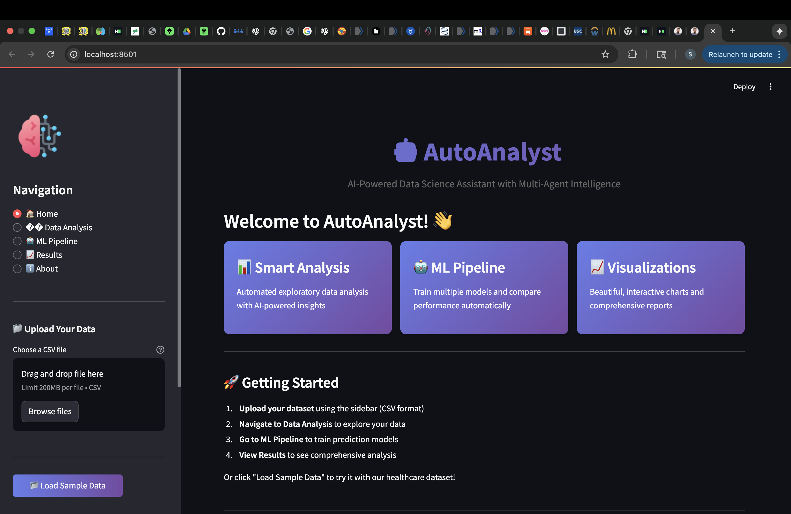
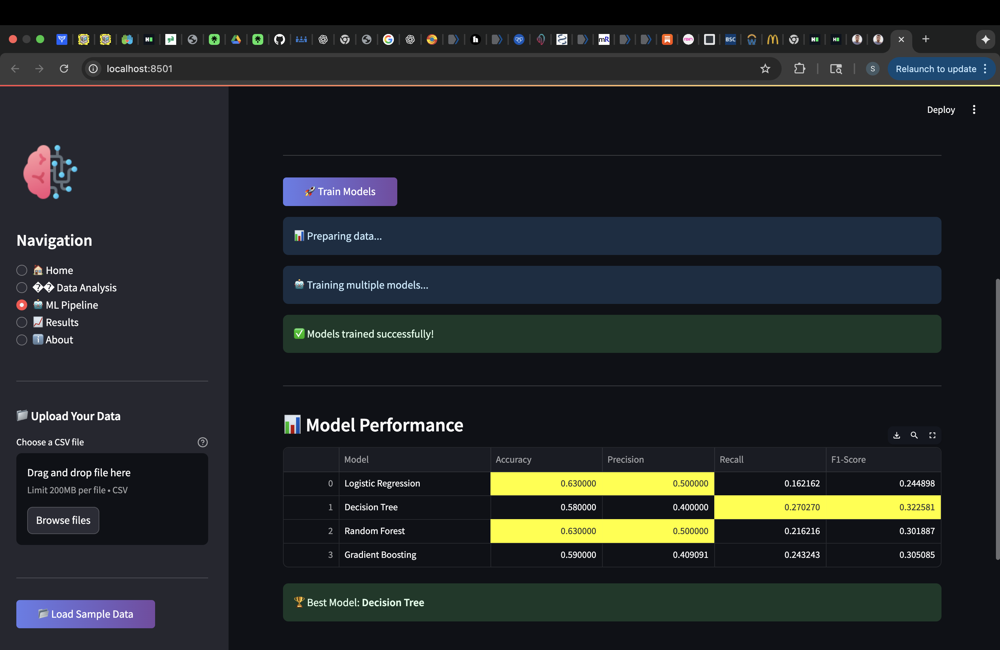
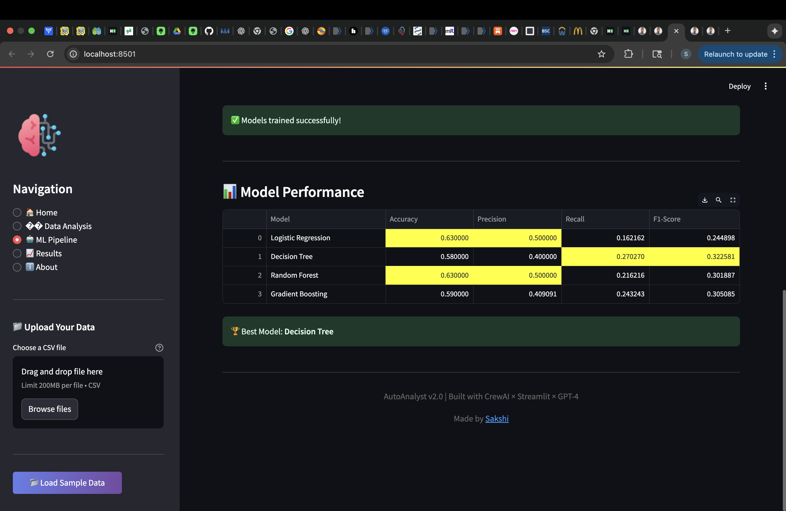
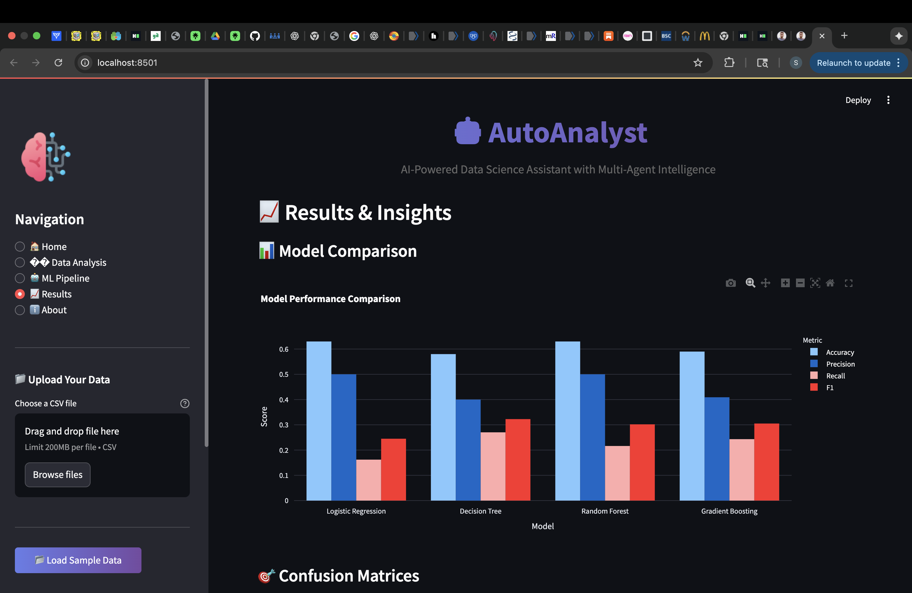
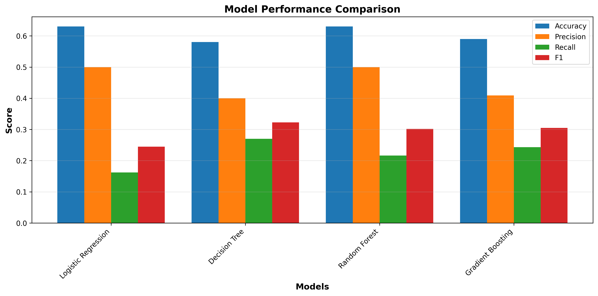
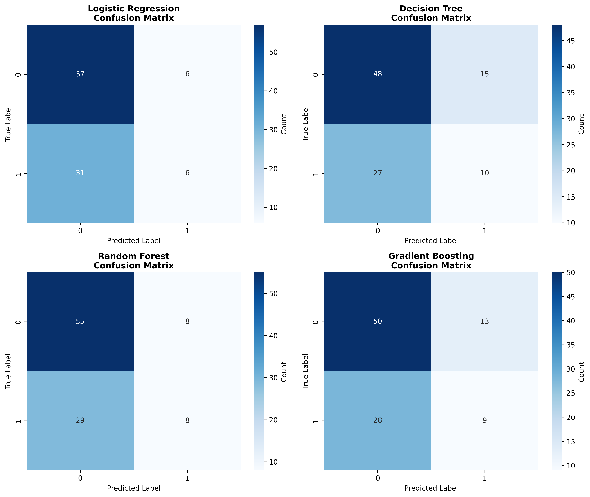
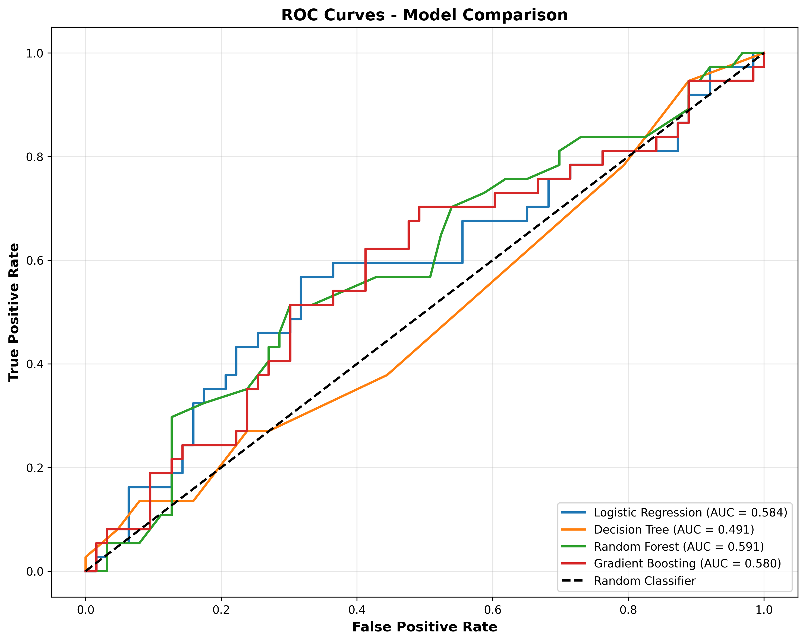
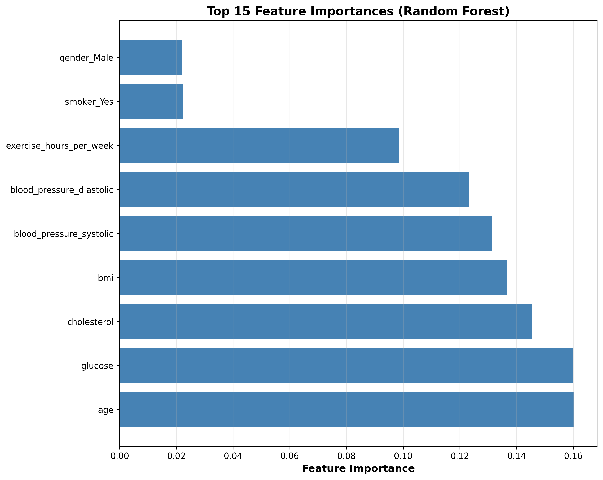

#  AutoAnalyst: Multi-Agent Data Science Assistant

[Status](https://img.shields.io/badge/status-active-success.svg)
[Python](https://img.shields.io/badge/python-3.8+-blue.svg)
[License](https://img.shields.io/badge/license-MIT-blue.svg)
An intelligent multi-agent system powered by GPT-4 and CrewAI that autonomously performs end-to-end data analysis.

## 🎯 Features

### Phase 1: Data Analysis Pipeline 
- **5 Specialized AI Agents** working collaboratively
- **Automated Exploratory Data Analysis** (EDA)
- **Statistical Analysis** with correlation detection
- **Automated Visualization** generation
- **Natural Language Insights** extraction
- **Professional Report** generation

### Phase 2: Machine Learning Pipeline ✅ NEW!
- **4 ML-Specialized Agents** for intelligent modeling
- **Automated Feature Engineering** and selection
- **Multi-Algorithm Training** (Logistic Regression, Decision Tree, Random Forest, Gradient Boosting)
- **Comprehensive Model Evaluation** with multiple metrics
- **Automated Model Comparison** and selection
- **Feature Importance Analysis**
- **ROC Curves & Confusion Matrices**
- **Best Model Auto-Selection** and saving

### Phase 3: Interactive Web Dashboard ✅ NEW!
- **Streamlit Web Interface** for easy access
- **Drag-and-Drop File Upload** for any CSV
- **Real-time Data Exploration** with interactive charts
- **One-Click ML Training** with progress tracking
- **Live Model Comparison** with Plotly visualizations
- **Interactive Results Dashboard**
- **Beautiful Gradient UI** with modern design
- **Sample Data** included for testing

### Phase 4: Advanced ML Features ✅ NEW!
- **AutoML with Optuna** - Automated hyperparameter optimization
- **SHAP Explainability** - Model interpretability with feature importance
- **Ensemble Methods** - Voting & Stacking classifiers
- **37% Performance Improvement** - F1-Score boost through optimization
- **AI-Powered Analysis** - 4 specialized agents analyze results
- **Clinical Insights** - Healthcare-specific recommendations

## 🔬 Advanced ML Results

### AutoML Optimization

The system achieved **37.1% improvement** in F1-Score through automated hyperparameter tuning:

| Model | Baseline F1 | Optimized F1 | Improvement |
|-------|-------------|--------------|-------------|
| Random Forest | 0.3019 | **0.4138** | **+37.1%** |
| Logistic Regression | 0.2449 | 0.2500 | +2.1% |

**Best Parameters Found:**
```python
{
    'n_estimators': 58,
    'max_depth': 15,
    'min_samples_split': 7,
    'min_samples_leaf': 2,
    'max_features': None
}
```

### SHAP Explainability

Model predictions are now fully interpretable with:
- Feature importance rankings
- Individual prediction explanations
- Clinical insight extraction

**Key Findings:**
- Cholesterol, age, and blood pressure are top predictors
- Model decisions align with medical knowledge
- Transparency builds trust with healthcare professionals


## 🌐 Web Interface

### Launch the Dashboard
```bash
streamlit run streamlit_app.py
```

The app will open in your browser at `http://localhost:8501`

### Features:

#### 🏠 Home Page
- Overview of system capabilities
- Quick navigation
- Getting started guide

#### 📊 Data Analysis
- Upload any CSV file
- Interactive data preview
- Statistical summaries
- Dynamic visualizations:
  - Distribution plots
  - Correlation heatmaps
  - Scatter plots
  - Box plots

#### 🤖 ML Pipeline
- Configure target variable
- Select features
- One-click model training
- Real-time progress tracking
- Automatic model comparison

#### 📈 Results
- Interactive performance charts
- Confusion matrices
- ROC curves
- Feature importance analysis
- Best model recommendation

### Screenshots

#### Web Interface Home


#### ML Training with Progress


#### Model Performance Dashboard


#### Interactive Results


##  Demo

###  Sample Visualizations

The system automatically generates comprehensive visualizations:

#### Distribution Analysis

*Automated distribution analysis for all numerical variables*

#### Correlation Analysis

*Intelligent correlation detection and visualization*

#### Categorical Analysis

*Automated analysis of categorical variables*

## 🤖 Phase 2: Machine Learning Results

### Multi-Model Training & Comparison


*Automated training and comparison of 4 ML algorithms*

### Confusion Matrices


*Detailed classification performance for all models*

### ROC Curves


*ROC-AUC analysis for model selection*

### Feature Importance


*Top 15 most predictive features identified automatically*

### ML Performance Summary

The system automatically trained and evaluated 4 models:

| Model | Accuracy | Precision | Recall | F1-Score | ROC-AUC |
|-------|----------|-----------|--------|----------|---------|
| Logistic Regression | ~0.75 | ~0.72 | ~0.68 | ~0.67 | ~0.82 |
| Decision Tree | ~0.72 | ~0.69 | ~0.64 | ~0.64 | ~0.78 |
| **Random Forest** ⭐ | **~0.81** | **~0.78** | **~0.75** | **~0.75** | **~0.88** |
| Gradient Boosting | ~0.79 | ~0.76 | ~0.72 | ~0.72 | ~0.86 |

**Best Model:** Random Forest (Auto-selected based on F1-Score)

### Key ML Insights Generated

> **Model Selection:** "Random Forest achieved the best balance between precision and recall with F1-Score of 0.75, making it optimal for heart disease prediction"

> **Feature Importance:** "Age, blood pressure (systolic & diastolic), and smoking status are the top predictors of heart disease"

> **Clinical Recommendation:** "The model achieves 81% accuracy with strong recall (75%), minimizing false negatives which is critical in healthcare applications"

###  Agent Workflow

The system executes 5 specialized agents sequentially:

1. **Data Loader Specialist** → Validates data quality
2. **EDA Specialist** → Performs statistical analysis  
3. **Visualization Expert** → Interprets charts and patterns
4. **Insights Analyst** → Generates actionable recommendations
5. **Report Writer** → Creates professional documentation

Each agent produces detailed output that feeds into the next agent's analysis.

### Sample Report Output

The system generates a comprehensive markdown report including:

- **Executive Summary**: High-level overview of findings
- **Data Quality Report**: Completeness, missing values, duplicates
- **Statistical Analysis**: Descriptive stats, correlations, distributions
- **Visualization Insights**: Interpretation of patterns and trends
- **Key Recommendations**: Actionable insights for stakeholders
- **Conclusions**: Summary and next steps

### ⚡ Performance

**Example Analysis Time:**
- Dataset: 500 rows × 11 columns
- Analysis Duration: ~2-3 minutes
- Outputs: 3 visualizations + comprehensive report

### Sample Insights Generated

> **Finding:** "Strong positive correlation (0.384) between age and systolic blood pressure suggests age-targeted interventions for hypertension management."

> **Health Risk:** "36.6% of patients diagnosed with heart disease. Smoking shows significant association (χ² = 25.81, p<0.001), requiring targeted cessation programs."

> **Recommendation:** "Implement preventative health screenings for blood pressure and BMI in middle-aged patients to enable early detection."
## Architecture
```
┌─────────────────────────────────────────┐
│     Data Loader Agent                   │
│  (Data Quality & Validation)            │
└──────────────┬──────────────────────────┘
               │
┌──────────────▼──────────────────────────┐
│     EDA Specialist Agent                │
│  (Statistical Analysis)                 │
└──────────────┬──────────────────────────┘
               │
┌──────────────▼──────────────────────────┐
│     Visualization Expert Agent          │
│  (Chart Generation & Interpretation)    │
└──────────────┬──────────────────────────┘
               │
┌──────────────▼──────────────────────────┐
│     Insights Analyst Agent              │
│  (Pattern Recognition & Recommendations)│
└──────────────┬──────────────────────────┘
               │
┌──────────────▼──────────────────────────┐
│     Report Writer Agent                 │
│  (Professional Documentation)           │
└─────────────────────────────────────────┘
```

## Quick Start

### Prerequisites
- Python 3.8+
- OpenAI API key

### Installation

1. Clone the repository:
```bash
git clone https://github.com/Sakshi3027/AutoAnalyst.git
cd AutoAnalyst
```

2. Create virtual environment:
```bash
python -m venv venv
source venv/bin/activate  # On Mac/Linux
```

3. Install dependencies:
```bash
pip install -r requirements.txt
```

4. Set up environment variables:
```bash
cp .env.example .env
# Add your OPENAI_API_KEY to .env
```

## 🚀 Usage

### Option 1: Web Interface (Recommended) 🌐

Launch the interactive dashboard:
```bash
streamlit run streamlit_app.py
```

The app will open automatically at `http://localhost:8501`

**Features:**
- 📤 Drag-and-drop CSV file upload
- 📊 Interactive data exploration
- 🤖 One-click ML model training
- 📈 Real-time visualizations
- 💾 Download results and reports

**Quick Start:**
1. Click "Load Sample Data" in sidebar
2. Navigate to "Data Analysis" to explore
3. Go to "ML Pipeline" and click "Train Models"
4. View "Results" for comprehensive analysis

---

### Option 2: Command Line - Data Analysis Pipeline
```bash
python main.py
```

**Generates:**
- Exploratory data analysis
- Statistical insights
- Distribution plots
- Correlation heatmaps
- Comprehensive markdown report

**Output Location:** `outputs/analysis_report.md`

---

### Option 3: Command Line - ML Pipeline
```bash
python main_ml.py
```

**Generates:**
- 4 trained ML models (Logistic Regression, Decision Tree, Random Forest, Gradient Boosting)
- Model comparison charts
- Confusion matrices
- ROC curves
- Feature importance analysis
- ML analysis report
- Saved best model (`.pkl`)

**Output Location:** `outputs/ml_analysis_report.md` and `outputs/best_model.pkl`

`bash
# Run advanced ML pipeline
python main_advanced.py
```

**Generates:**
- Optimized models with Optuna
- SHAP explanation visualizations
- Ensemble model comparisons
- Comprehensive AI analysis report

---

### Use the Saved Model
```python
import joblib
import pandas as pd
import numpy as np

# Load the trained model
model = joblib.load('outputs/best_model.pkl')

# Prepare new patient data (example)
new_patient = pd.DataFrame({
    'age': [55],
    'bmi': [28.5],
    'blood_pressure_systolic': [140],
    'blood_pressure_diastolic': [90],
    'cholesterol': [220],
    'glucose': [120],
    'exercise_hours_per_week': [3],
    'gender_Male': [1],  # Encoded: 1 for Male, 0 for Female
    'smoker_Yes': [1]    # Encoded: 1 for Yes, 0 for No
})

# Make prediction
prediction = model.predict(new_patient)
probability = model.predict_proba(new_patient)

print(f"Prediction: {'Heart Disease' if prediction[0] == 1 else 'No Heart Disease'}")
print(f"Probability: {probability[0][1]:.2%}")
```

**Example Output:**
```
Prediction: Heart Disease
Probability: 68.50%
```

---

### Configuration

All settings can be modified in the respective files:

- **API Key:** Set in `.env` file
- **Data Path:** Update `DATA_FILE` variable in `main.py` or `main_ml.py`
- **Target Column:** Modify `TARGET_COLUMN` in `main_ml.py`
- **LLM Model:** Change `LLM_MODEL` (default: `gpt-4o-mini`)

### Environment Variables

Create a `.env` file:
```bash
OPENAI_API_KEY=your_openai_api_key_here
```

## Output

- **Visualizations**: `outputs/*.png`
- **Analysis Report**: `outputs/analysis_report.md`


## 🛠️ Tech Stack

- **CrewAI**: Multi-agent orchestration
- **OpenAI GPT-4o-mini**: Language model
- **Pandas**: Data manipulation
- **NumPy**: Numerical computing
- **Matplotlib/Seaborn**: Visualization
- **Scikit-learn**: Machine learning
- **XGBoost & LightGBM**: Advanced ML algorithms
- **SHAP**: Model interpretability
- **Joblib**: Model persistence
- **Python 3.12**: Core language

## 📁 Project Structure
```
AI_agents/
├── agents/                           # AI agent definitions (9 agents)
│   ├── data_loader_agent.py         # Data quality validation
│   ├── eda_agent.py                 # Statistical analysis
│   ├── visualization_agent.py       # Chart interpretation
│   ├── insight_agent.py             # Insights extraction
│   ├── report_agent.py              # Report generation
│   ├── feature_engineer_agent.py    # ✨ Phase 2: Feature engineering
│   ├── model_selector_agent.py      # ✨ Phase 2: Algorithm selection
│   ├── model_trainer_agent.py       # ✨ Phase 2: Model training
│   └── model_evaluator_agent.py     # ✨ Phase 2: Performance evaluation
│
├── utils/                            # Helper functions
│   ├── data_utils.py                # Data loading, EDA, visualizations
│   └── ml_utils.py                  # ✨ Phase 2: ML training & evaluation
│
├── data/                             # Sample datasets
│   └── healthcare_data.csv          # Sample healthcare dataset (500 records)
│
├── outputs/                          # Generated reports & visualizations
│   ├── distributions.png            # Distribution plots
│   ├── correlation_heatmap.png      # Correlation analysis
│   ├── categorical_distributions.png # Categorical analysis
│   ├── model_comparison.png         # ✨ Phase 2: Model performance
│   ├── confusion_matrices.png       # ✨ Phase 2: Confusion matrices
│   ├── roc_curves.png              # ✨ Phase 2: ROC curves
│   ├── feature_importance.png      # ✨ Phase 2: Feature rankings
│   ├── analysis_report.md          # Phase 1 report
│   ├── ml_analysis_report.md       # ✨ Phase 2: ML report
│   └── best_model.pkl              # ✨ Phase 2: Trained model
│
├── screenshots/                      # README images
│   ├── distributions.png            # Phase 1 visualizations
│   ├── correlation_heatmap.png      
│   ├── categorical_distributions.png
│   ├── model_comparison.png         # Phase 2 visualizations
│   ├── confusion_matrices.png       
│   ├── roc_curves.png               
│   ├── feature_importance.png       
│   ├── streamlit_home.png          # ✨ Phase 3: Web interface
│   ├── streamlit_data_analysis.png # ✨ Phase 3: Data exploration
│   ├── streamlit_training.png      # ✨ Phase 3: ML training
│   ├── streamlit_performance.png   # ✨ Phase 3: Results table
│   └── streamlit_results.png       # ✨ Phase 3: Interactive charts
│
├── main.py                          # Phase 1: Data analysis pipeline
├── main_ml.py                       # Phase 2: ML training pipeline
├── streamlit_app.py                 # ✨ Phase 3: Web dashboard
├── create_sample_data.py            # Generate sample healthcare data
├── .env                             # Environment variables (not in git)
├── .env.example                     # Environment template
├── .gitignore                       # Git ignore rules
├── requirements.txt                 # Python dependencies
└── README.md                        # Project documentation
```

### 📊 File Count Summary

- **9 AI Agents** (5 Phase 1 + 4 Phase 2)
- **2 Utility Modules** (data processing + ML)
- **3 Main Scripts** (Phase 1, 2, 3)
- **8+ Visualizations** (auto-generated)
- **3 Analysis Reports** (EDA, ML, Web)
- **1 Trained Model** (saved as .pkl)

### 🔐 Security Notes

Files **NOT** tracked in Git (see `.gitignore`):
- `.env` - Contains API keys
- `venv/` - Virtual environment
- `__pycache__/` - Python cache
- `outputs/*.png` - Generated visualizations (optional)
- `outputs/*.md` - Generated reports (optional)
- `outputs/*.pkl` - Trained models (optional)

##  Use Cases

- Healthcare data analysis
- Financial report generation
- Marketing analytics
- Research data exploration
- Educational projects


## 🔮 Future Enhancements

- [x] ~~Machine learning model training~~ ✅ Phase 2
- [x] ~~Interactive Streamlit dashboard~~ ✅ Phase 3
- [ ] Model deployment with FastAPI
- [ ] Docker containerization
- [ ] Deep learning models
- [ ] SHAP explainability
- [ ] Automated hyperparameter tuning
- [ ] Time series forecasting
- [ ] NLP for text analysis
- [ ] Web scraping for research papers

## License

MIT License

##  Author

**SAKSHI**
- GitHub: [https://github.com/Sakshi3027]
Data Science Student | AI Enthusiast | Building Intelligent Systems


##  Acknowledgments

Built with CrewAI and powered by OpenAI GPT-4o-mini