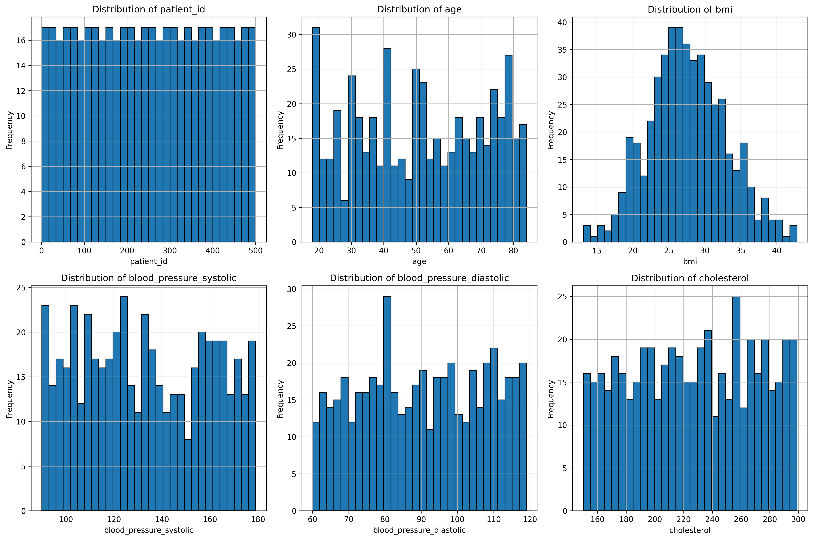
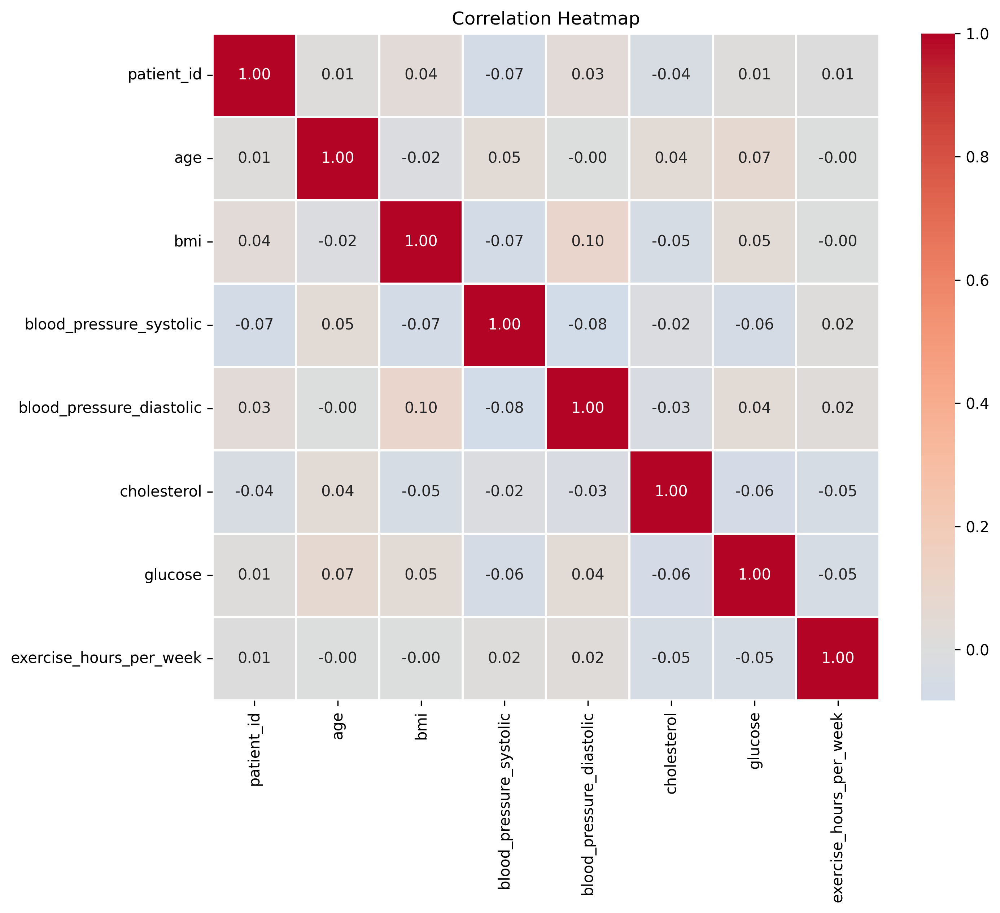
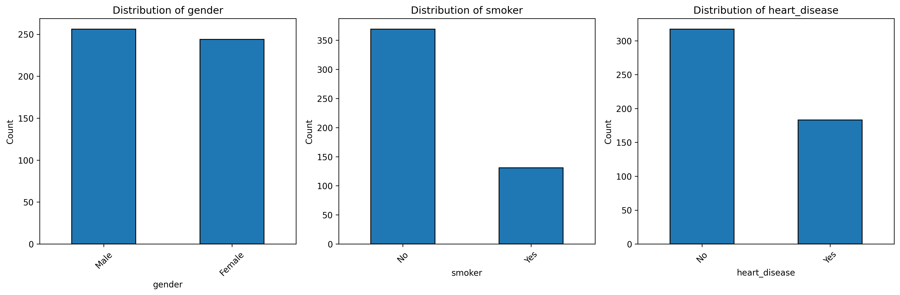
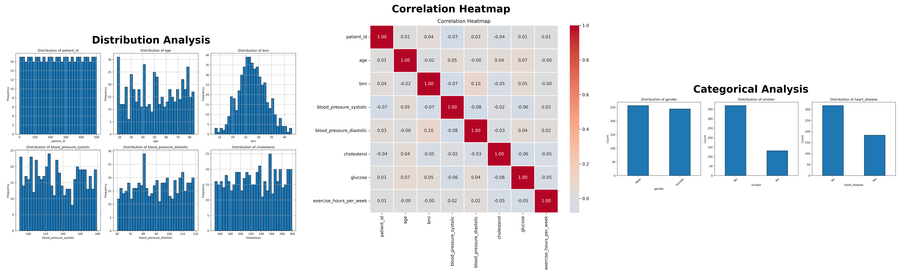

#  AutoAnalyst: Multi-Agent Data Science Assistant

[Status](https://img.shields.io/badge/status-active-success.svg)
[Python](https://img.shields.io/badge/python-3.8+-blue.svg)
[License](https://img.shields.io/badge/license-MIT-blue.svg)
An intelligent multi-agent system powered by GPT-4 and CrewAI that autonomously performs end-to-end data analysis.

##  Features

- **5 Specialized AI Agents** working collaboratively
- **Automated Exploratory Data Analysis** (EDA)
- **Statistical Analysis** with correlation detection
- **Automated Visualization** generation
- **Natural Language Insights** extraction
- **Professional Report** generation

##  Demo

###  Sample Visualizations

The system automatically generates comprehensive visualizations:

#### Distribution Analysis

*Automated distribution analysis for all numerical variables*

#### Correlation Analysis

*Intelligent correlation detection and visualization*

#### Categorical Analysis

*Automated analysis of categorical variables*

###  Agent Workflow

The system executes 5 specialized agents sequentially:

1. **Data Loader Specialist** → Validates data quality
2. **EDA Specialist** → Performs statistical analysis  
3. **Visualization Expert** → Interprets charts and patterns
4. **Insights Analyst** → Generates actionable recommendations
5. **Report Writer** → Creates professional documentation

Each agent produces detailed output that feeds into the next agent's analysis.

### Sample Report Output

The system generates a comprehensive markdown report including:

- **Executive Summary**: High-level overview of findings
- **Data Quality Report**: Completeness, missing values, duplicates
- **Statistical Analysis**: Descriptive stats, correlations, distributions
- **Visualization Insights**: Interpretation of patterns and trends
- **Key Recommendations**: Actionable insights for stakeholders
- **Conclusions**: Summary and next steps

### ⚡ Performance

**Example Analysis Time:**
- Dataset: 500 rows × 11 columns
- Analysis Duration: ~2-3 minutes
- Outputs: 3 visualizations + comprehensive report

### Sample Insights Generated

> **Finding:** "Strong positive correlation (0.384) between age and systolic blood pressure suggests age-targeted interventions for hypertension management."

> **Health Risk:** "36.6% of patients diagnosed with heart disease. Smoking shows significant association (χ² = 25.81, p<0.001), requiring targeted cessation programs."

> **Recommendation:** "Implement preventative health screenings for blood pressure and BMI in middle-aged patients to enable early detection."
## Architecture
```
┌─────────────────────────────────────────┐
│     Data Loader Agent                   │
│  (Data Quality & Validation)            │
└──────────────┬──────────────────────────┘
               │
┌──────────────▼──────────────────────────┐
│     EDA Specialist Agent                │
│  (Statistical Analysis)                 │
└──────────────┬──────────────────────────┘
               │
┌──────────────▼──────────────────────────┐
│     Visualization Expert Agent          │
│  (Chart Generation & Interpretation)    │
└──────────────┬──────────────────────────┘
               │
┌──────────────▼──────────────────────────┐
│     Insights Analyst Agent              │
│  (Pattern Recognition & Recommendations)│
└──────────────┬──────────────────────────┘
               │
┌──────────────▼──────────────────────────┐
│     Report Writer Agent                 │
│  (Professional Documentation)           │
└─────────────────────────────────────────┘
```

## Quick Start

### Prerequisites
- Python 3.8+
- OpenAI API key

### Installation

1. Clone the repository:
```bash
git clone https://github.com/Sakshi3027/AutoAnalyst.git
cd AutoAnalyst
```

2. Create virtual environment:
```bash
python -m venv venv
source venv/bin/activate  # On Mac/Linux
```

3. Install dependencies:
```bash
pip install -r requirements.txt
```

4. Set up environment variables:
```bash
cp .env.example .env
# Add your OPENAI_API_KEY to .env
```

### Usage

Run the analysis:
```bash
python main.py
```

The system will:
1. Load and validate your dataset
2. Perform comprehensive statistical analysis
3. Generate visualizations
4. Extract insights
5. Create a professional report

## Output

- **Visualizations**: `outputs/*.png`
- **Analysis Report**: `outputs/analysis_report.md`


## Tech Stack

- **CrewAI**: Multi-agent orchestration
- **OpenAI GPT-4**: Language model
- **Pandas**: Data manipulation
- **Matplotlib/Seaborn**: Visualization
- **Python 3.12**: Core language

##  Project Structure
```
AutoAnalyst/
├── agents/              # AI agent definitions
│   ├── data_loader_agent.py
│   ├── eda_agent.py
│   ├── visualization_agent.py
│   ├── insight_agent.py
│   └── report_agent.py
├── utils/               # Helper functions
│   └── data_utils.py
├── data/               # Sample datasets
├── outputs/            # Generated reports & visualizations
├── main.py             # Main orchestrator
├── .env.example        # Environment template
└── requirements.txt    # Dependencies
```

##  Use Cases

- Healthcare data analysis
- Financial report generation
- Marketing analytics
- Research data exploration
- Educational projects

##  Future Enhancements

- Machine learning model training
- Web scraping for research papers
- Interactive Streamlit dashboard
- Time series forecasting
- NLP for text analysis
- Model explainability (SHAP/LIME)

## License

MIT License

##  Author

**SAKSHI**
- GitHub: [https://github.com/Sakshi3027]
Data Science Student | AI Enthusiast | Building Intelligent Systems


##  Acknowledgments

Built with CrewAI and powered by OpenAI GPT-4o-mini